<html lang="ja">
    <head>
        <meta charset="utf-8" />
    </head>
    <body>
        <h1>
RgbPly
</h1>
        <h2>なにものか？</h2>
        

            RGB画像とテクスチャ座標付き3Dデータ(.ply)を指定してテクスチャーマップされた3Dオブジェクトを表示します。
 
            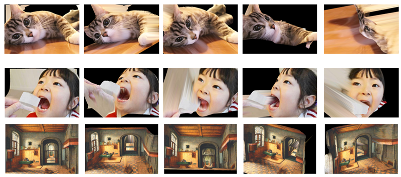
        

        <h2>環境構築方法</h2>
        

            pip install opencv-python PyOpenGL glfw
        

        <h2>使い方</h2>
        

            python  RgbPly.py  (RGB画像ファイル)  (テクスチャー座標付きPLYファイル)  [(zスケール)] 
            ※ ピクセルとz値の比率が不明のため、zスケール引数で調整します。 
            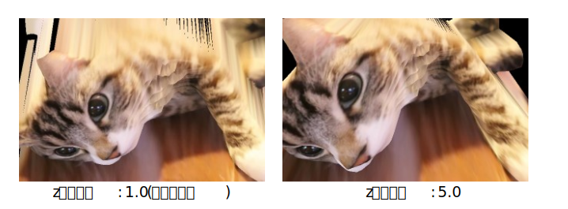
            <table border="1">
                <tr><th>操作</th><th>機能</th></tr>
                <tr><td>左ボタン押下＋ドラッグ</td><td>3Dモデルの回転(yaw,pitch)</td></tr>
                <tr><td>rキー押下＋ホイール回転</td><td>3Dモデルの回転(roll)</td></tr>
                <tr><td>右ボタン押下＋ドラッグ</td><td>3Dモデルの移動</td></tr>
                <tr><td>ホイール回転</td><td>3Dモデルの拡大・縮小</td></tr>
                <tr><td>ホイールボタン押下</td><td>慣性モードのトグル(on⇔off)</td></tr>
                <tr><td>iキー押下</td><td>(同上)</td></tr>
                <tr><td>sキー押下</td><td>スクリーンショット保存</td></tr>
                <tr><td>ウィンドウ閉じるボタン押下　</td><td>プログラム終了</td></tr>
            </table>
        

        <h2>テクスチャー座標付きPLYファイルの作成例</h2>
        <h3>ステップ１. depth推定ソフトウェアで画像からdepth画像を作成する。</h3>
        

            Depth Anything V2 などを使って画像からdepth画像を作成する。 
            <a href="https://huggingface.co/spaces/depth-anything/Depth-Anything-V2">https://huggingface.co/spaces/depth-anything/Depth-Anything-V2</a> 
             
            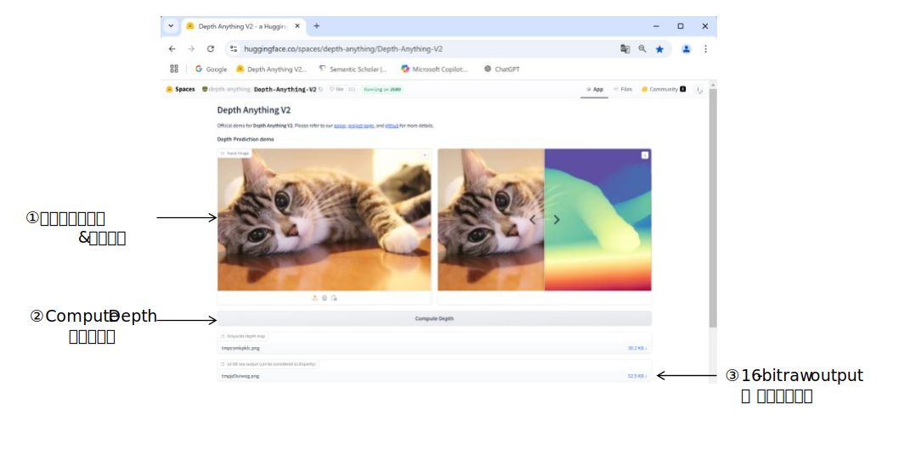
         

        <h3>ステップ２. depth画像を三角形分割して密なPLYファイルを作成する。</h3>
        

            python depth2ply.py (depth画像ファイル名) 
            ⇒ (depth画像ファイル名).ply が作成される。 
            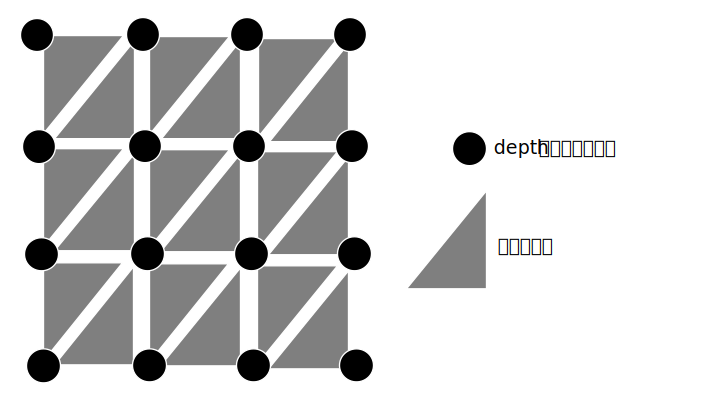
        

        <h3>ステップ３. 密なPLYファイルを間引いて疎なPLYファイルを作成する。</h3>
        <h4>Blender 3.6 を使って間引く例</h4>
        

            ①Blender 3.6を起動し、スプラッシュ画像以外をクリックする。 
            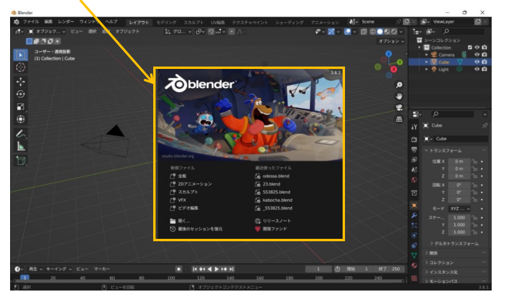 
            ②立方体をクリックし、DELキーを押下して削除する。 
            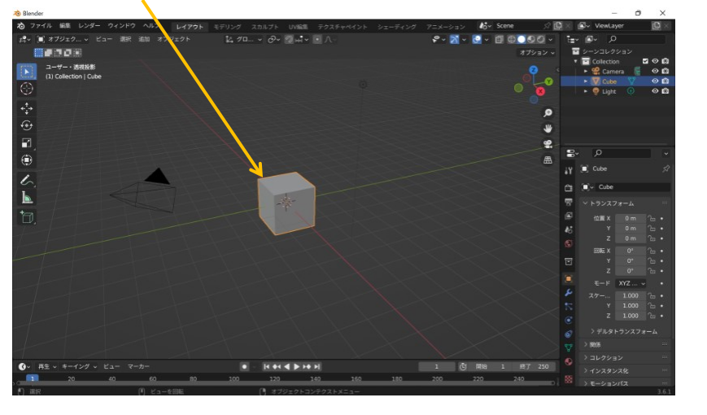 
            ③ファイル → インポート → スタンフォード(.ply) → ステップ２で作成したPLYファイルを開く。 
            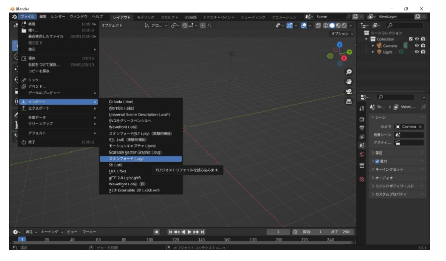 
            ④レンチの形をしたアイコン(モディファイアーアイコン)をクリックする。 
            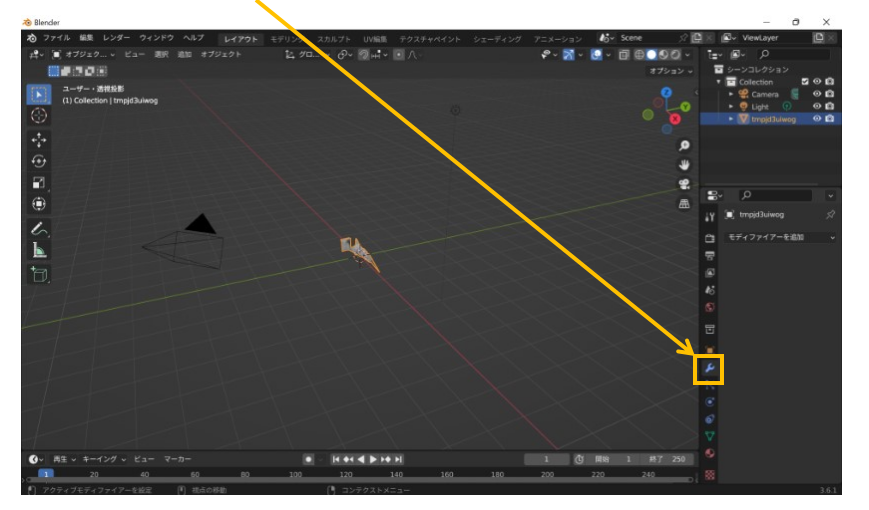 
            ⑤モディファイアーを追加をクリックする。 
            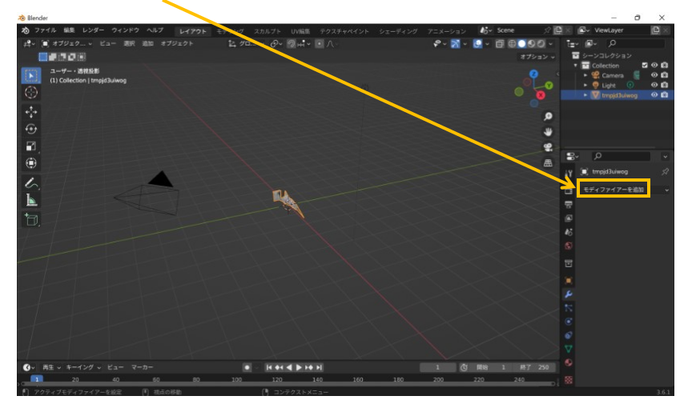 
            ⑥デシメートをクリックする。 
            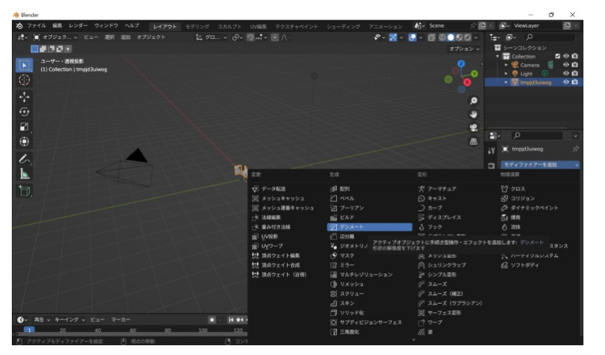 
            ⑦比率を指定し、面数が減るのを待つ 
            例) 1/100に間引きたい場合は 0.01 を指定する。 
            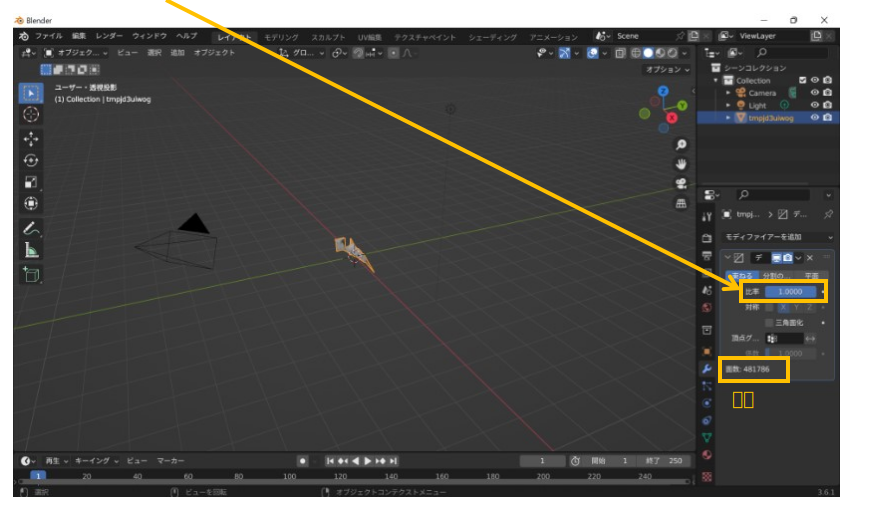 
            ⑧ファイル → エクスポート → スタンフォード(.ply) → 間引かれたPLYファイルを保存する。 
            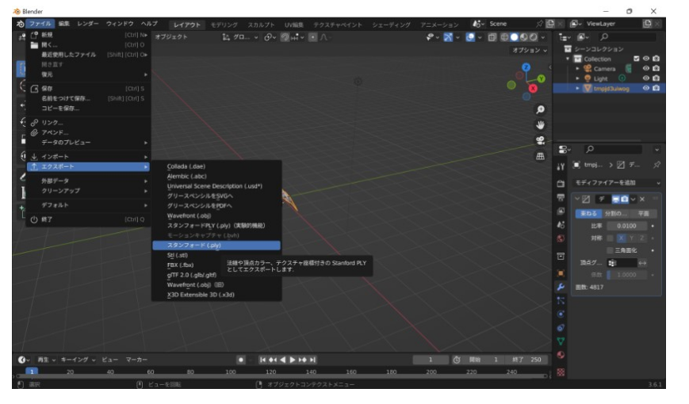 
        

    </body>
</html>
